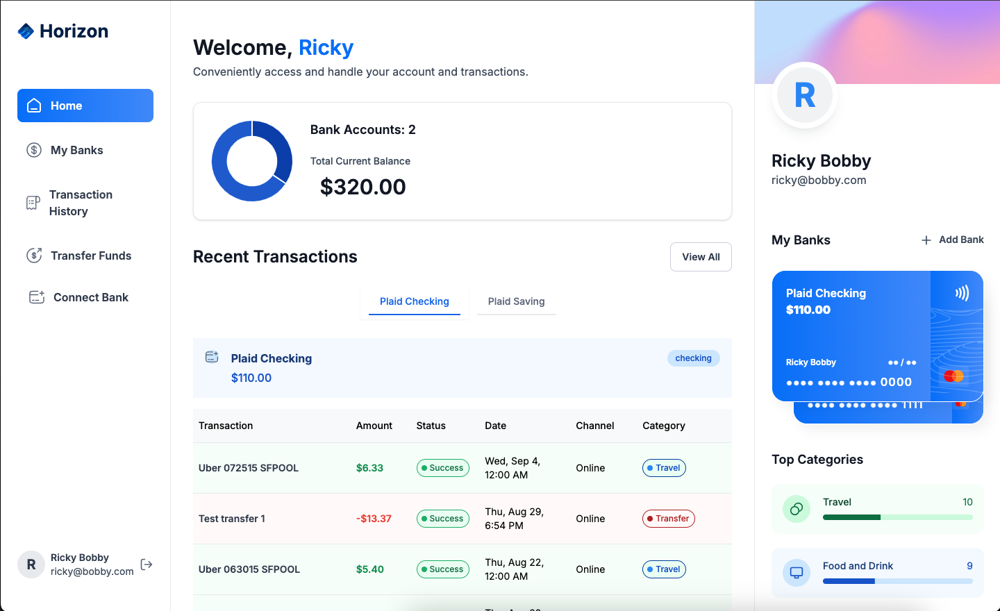

# Horizon Banking App

## Table of contents

- [Overview](#overview)
  - [The challenge](#the-challenge)
  - [Screenshot](#screenshot)
  - [Links](#links)
- [My process](#my-process)
  - [Built with](#built-with)
  - [What I learned](#what-i-learned)
  - [Continued development](#continued-development)
- [Author](#author)

## Overview

### The challenge

Users should be able to:

- Sign up or sign in to their personal banking dashboard
- Securely connect bank accounts utilizing Plaid Link
- View account balances and transactions for each connected account
- Securely make electronic bank transfers utilizing Dwolla payment gateway

### Screenshot

### Links

- Live Site URL: [Here](https://horizon-banking-app-six.vercel.app/)

## My process

### Built with

- Semantic HTML5 markup
- TailwindCSS
- JavaScript
- TypeScript
- Next.js
- React.js
- Plaid
- Dwolla
- Appwrite
- Zod
- ShadCN
- Chart.js

### What I learned

In this project I learned several new tools and techniques. I learned how to structure my TypeScript better in a more succinct manner. I also learned how to implement Appwrite for its Auth and database uses, Plaid for secure bank account accessibility, and Dwolla for bank transactions. In addition, I utilized ShadCN and Chart.js in additional ways to grow upon my front end skills.

### Continued development

I am excited to continue to learn new tools and techniques to build bigger and better applications.

## Author

- Portfolio - [Nate Valline](https://natevalline.dev)
- LinkedIn - [Nate Valline](https://www.linkedin.com/in/nvalline)
